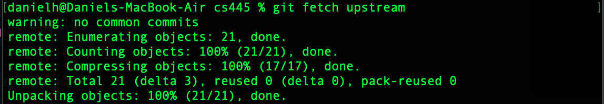

# this is MarkDown test on labs

#this is clone


#this is fetch


#this is remote


#this is pullRequest


# Heading One
## Heading Two
## Heading three

```javascript code
   funcion sum(num1,num2){
        return num1 + num2
   }

```javascript code

*text* is italic
_text_is italics

[LinkToTinaXingGit](bellaxing/CS445-May2021-Lab1)

1.Item 1
1.Item 2
1.Item 3

`<p>hello professor Tna</p>`